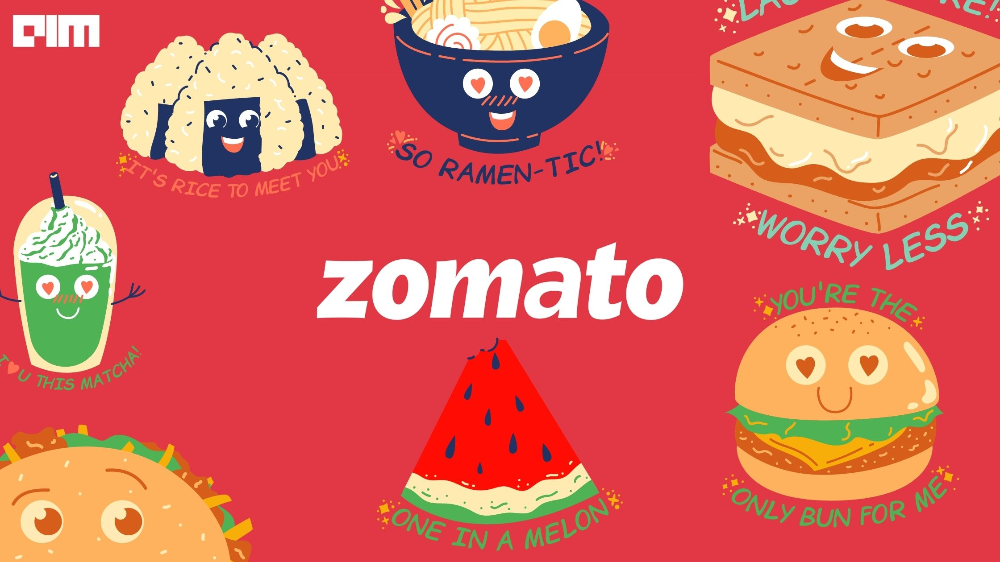

# Zomato Restaurant Clustering and Sentiment Analysis

## Project Overview

This project applies unsupervised machine learning techniques to analyze restaurant data and customer reviews from the popular food delivery platform, Zomato. The goal is to gain insights into customer experiences and restaurant segmentation through clustering and sentiment analysis.

---

## Features

- **Data Cleaning and Preprocessing:**  
  Handles missing values, removes duplicates, and structures data for analysis.

- **Clustering:**  
  Implements k-means clustering on restaurants based on location, cuisine, and average cost for two to group similar restaurants into meaningful clusters.

- **Sentiment Analysis:**  
  Classifies customer reviews into positive, negative, or neutral sentiments to gauge overall customer satisfaction.

- **Visualization:**  
  Provides word clouds for frequent review terms, cluster visualizations, and sentiment distributions.

---

## Installation

1. Clone the repository:  
`git clone https://github.com/aditisahu911/zomato-clustering-and-sentiment-analysis.git`

2. Navigate into the project directory:  
`cd zomato-clustering-and-sentiment-analysis`

4. Install required packages:
`pip install -r requirements.txt`

---

## Usage

- Run the Jupyter notebook to execute data preprocessing, clustering, and sentiment analysis steps.  
- Explore the visualizations to understand restaurant clusters and sentiment distribution.  
- Use the insights to guide restaurant recommendations, marketing strategies, and customer satisfaction improvements.

---

## Key Findings

- Restaurants clustered into 5 groups based on location, cuisine, and cost.  
- Customers generally expressed positive sentiment toward restaurants.  
- Absolute Barbecues showed maximum engagement and highest average ratings.  
- Popular cuisines include North Indian and Chinese.  
- Price points and ratings varied significantly across clusters and individual restaurants.  
- Analysis aids in personalized recommendations and targeted marketing.

---

## Future Work

- Extend analysis to other cities or countries to capture regional preferences.  
- Integrate collaborative filtering to complement content-based insight.  
- Deploy recommendation system as a web application.  
- Incorporate more detailed metadata and temporal trends in reviews.

---

## Repository

[GitHub Repository Link](https://github.com/aditisahu911/zomato-clustering-and-sentiment-analysis)

---

## Author

Aditi Sahu    
Email: aditisahu24@iitk.ac.in

